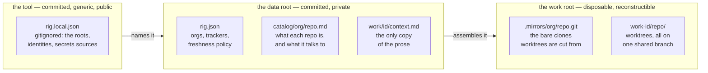
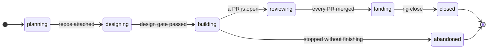
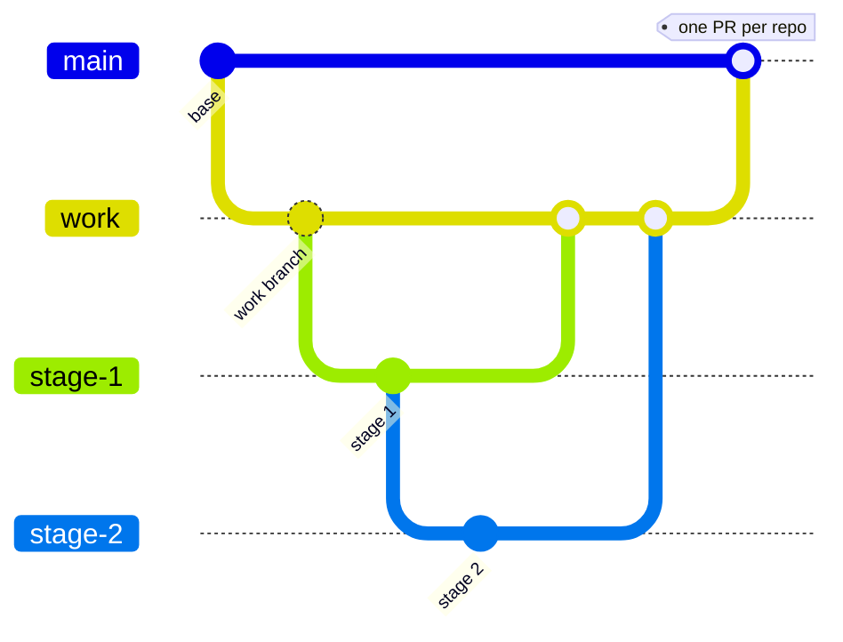

# rig

A cross-repo work harness: name a piece of work, attach the repos it touches, and rig gives you one folder with a worktree per repo, all on one shared branch. What is durable about that work — which repos, why, what was decided — lives in a committed **data root** beside the tool, and every command that changes a work commits it at that moment.

```powershell
irm https://raw.githubusercontent.com/hugoforte/rig/main/install.ps1 | iex
```

```bash
curl -fsSL https://raw.githubusercontent.com/hugoforte/rig/main/install.sh | sh
```

Then one command starts a work:

```powershell
rig new refund-double-charge --title "Refunds double-charge on retry" --key PROJ-42
```

From there: `rig attach billing` adds a repo, once per repo; `rig status` shows every worktree live; `rig list` says what is open and what is safe to close; `rig close` takes the worktrees away and keeps the record. Before the first work, `rig init` names the roots once — see [Setting up](#setting-up) — and `rig doctor` checks the rest for you.

## How it fits together

Three things are worth a minute before you go further: where rig puts what, how a work moves, and what the branches look like.

### The three roots



Everything committed is worth keeping. Everything under the work root can be deleted tonight. That split is the whole design; [DESIGN.md](./DESIGN.md) says why, and its §3 has the layout path by path.

rig reads its config from two files and no others: `rig.json` in the data root is the org half, committed and shared (orgs, trackers, the freshness policy, the record-format stamp); `rig.local.json` beside the tool is the machine half, gitignored (the roots, identities, secrets sources, a per-machine freshness override). The data root is never the tool's own checkout — knowledge inside a public tree is one `git add` from a leak, and `rig doctor` reports that layout as not set up.

### A work's life



That is the **phase** — where a work is now. It is always derived, from the repos attached, the branches, the PRs and the gates recorded, and never stored, so it cannot go stale. Active phases are present participles and the two terminal ones are past, so the word itself tells you whether the work is still moving. Any phase can end in `abandoned`: the recorded decision to stop a work without finishing it, terminal like `closed` and deliberately distinct from it.

The only lifecycle facts written down are the **gates** that have been passed, each with its date — `designedAt`, `abandonedAt`, `closedAt` — because those are the only ones nothing can observe afterwards. A gate is a point where the agent stops for a decision, and it is also where rig commits and pushes the data root. `rig save -m "design agreed" --designed` is the one you pass by hand.

### Branches and stages

A work cuts one **work branch**, sharing a name across every attached repo, and lands in the **base branch** in one shot: one PR per repo, at the end.



A **stage** is a delivery slice of a work: one coherent piece of scope, carried by a branch and reviewed on its own. Stages stack — the first on the work branch, each one after it on the stage before — and merge down into the work branch. Scope, never lifecycle: a stage is not a gate, and a work with no stages is simply one folder of worktrees on one branch.

Base is a relation, not a name for any particular branch. `rig status` reads each branch's base off its own PR, so a branch stacked on another one reads as `base main → feat/other-work` rather than still claiming `main`.

## Going deeper

- [AGENTS.md](./AGENTS.md) — for agents driving rig: the commands, the rules and the gates, in the order an agent meets them.
- [DESIGN.md](./DESIGN.md) — why it is shaped this way, with the decision log and the post-mortem of the tool this one replaced.
- [CONTEXT.md](./CONTEXT.md) — what the words mean: one definition each, with the synonyms it displaces.
- [docs/adr/](./docs/adr/) — the decisions that were hard to reverse.
- [Principles](./DESIGN.md#principles) — what the decisions have in common: keep it refactorable, don't factor it early; strong convictions, loosely held.

## Reference

Everything from here down is detail. Nothing above needs it.

### Prerequisites

- Node 18 or newer, and `git`.
- `gh`, logged in (`gh auth login`). rig uses it to find repos, read PR state and open issues.
- `twg` on PATH, only for an org whose tickets live in Jira. GitHub-only setups never need it.

No need to verify them by hand: `rig doctor` checks all of these once rig is installed. Windows is the first-class platform; Linux and macOS run the same code and the same tests.

### Install, in full

The one-line script clones rig — `C:\rig` on Windows, `~/rig` elsewhere — runs `npm install -g` on the clone, and ends with `rig help` so you can see it worked. Run it again over a checkout that already exists and it changes nothing: no fetch, no reset, no `rig update`. It never runs `rig init` — setting rig up is a deliberate step of its own. To install somewhere else, save the script instead of piping it, and pass the path: `.\install.ps1 D:\rig`, `sh install.sh /opt/rig`.

Or the three commands it runs, by hand:

```powershell
gh repo clone hugoforte/rig C:\rig
npm install -g C:\rig
rig help
```

`npm install -g` links the checkout rather than copying it, so the command always runs whatever is in `C:\rig`. That is what lets `rig update` bring it forward later. In Git Bash, Linux or macOS the same three lines work with a forward-slash path of your choosing, and `rig` is on PATH there too.

### Setting up

Ten minutes to a first work with two worktrees on disk. This path keeps everything on your machine and asks nothing about tickets.

```powershell
rig init --data-root C:\rig-data --work-root C:\w --orgs your-org --tracker your-org=none --email you@example.com
rig doctor
```

`init` creates the data root as a git checkout with a first commit, writes `rig.local.json` in the clone beside `package.json` (gitignored: the paths, your identity per org), creates the work root, and sets `core.longpaths` so deep `node_modules` paths do not break. `your-org` is a GitHub org or user; `--tracker your-org=none` means no ticket system yet. Re-running `init` is safe. `doctor` should come back clean. Without `--work-root`, `init` picks `D:\w` when a D: drive exists and `~\w` otherwise.

```powershell
rig new my-first-work --title "Trying rig"     # no prompt; a brief may be piped in
cd C:\w\my-first-work
rig attach some-repo                           # any repo in your org
rig attach another-repo
rig status
```

`new` records the work in the data root and makes `C:\w\my-first-work`. Commands that act on a work find it from the folder you are in, or take `--work my-first-work` from anywhere. Each `attach` finds the repo in your org through `gh`, clones a bare mirror once, cuts a worktree on the work's branch, and for a repo it has not seen drafts a catalogue entry, asking with a `!` that you correct it while the repo is fresh in your head. A first run can come back to that. `status` shows every worktree, its branch, and how far it is from its base — all derived live, none of it written down.

The work's prose lives in one place, `C:\rig-data\work\my-first-work\context.md`. Edit it, then `rig save -m "…"` commits it; `rig save --designed` passes the design gate. When the PRs are merged, `rig list` says so and `rig close` removes the worktrees, keeping the record.

**What now.** `rig next` answers it, by reading live state rather than a remembered plan: nothing attached yet, the design gate not recorded, commits not pushed, a branch waiting for a pull request, three repos that want a rollout plan, everything merged and ready to close. It **only ever offers** — it never warns, never blocks and never says you should have; warnings live in `rig doctor`, and only for contradictions. And it speaks only when asked: a command you run, not a hook. How much ceremony a work carries is derived from what it contains, never declared — there is no `--track`, because a declaration made at `rig new` is a prediction and predictions rot.

**Slicing a work up.** A big work is delivered in stages: `rig stage feat/schema --delivers "the write path"` declares one, and `rig stage` reads the stack back in the order the branches are actually stacked. What is stored is the branch and that one line; whether a stage has started, is up for review or has landed, which repos carry it and where it sits in the stack are all derived from the branches and the PRs every time you ask. rig does not cut the branch — you do, where branches are made — and declaring it is what joins those branches into one slice across repos. A work with no stages behaves exactly as it always did, which is most works.

**Opening the pull requests.** `rig pr` opens one per repo, work branch to the base it was cut from. The body is assembled from what the record already holds — the title, the tickets, the Direction section of the context doc lifted verbatim, and the stage table rendered from the stack — so the deploy-order table stops being something anyone types. It is not a gate, and it is idempotent: a repo that already has an open PR is reported, not duplicated.

**The rollout plan.** For a work spanning enough repos that deploy order matters, `rig plan` writes one — part generated, part prose. The deploy-order table lives between markers and is rendered from the stage list with live PR state; `rig plan --refresh` rewrites it when the stack moves, and touches nothing around it. The rest is yours, and it is the half that earns the document: why the order is mandatory, the rejection window between deploys, the per-tenant prerequisites, the rollback. `rig next` compares the table to the stack and offers the refresh when they disagree — because an artifact nothing reads back is one that quietly goes wrong.

**Stopping a work you did not finish.** `rig close --abandoned` is the honest exit. It runs the same teardown and drops only the checks that ask whether the work landed — an unmerged PR and unpushed commits are what being abandoned looks like — while uncommitted changes still refuse, because unsaved work is the one thing a teardown can destroy. The ticket is told and left open, and open PRs are named and left alone.

One data root is the normal case. Keeping personal, open-source and employer knowledge apart needs more than one, which is [More than one data root](#more-than-one-data-root) below.

`RIG_LOCAL_CONFIG` names `rig.local.json` somewhere other than beside the tool — for a second installation sharing one checkout, or for a test — and a relative `dataRoot` inside it is read against that file's own directory. A key belonging to the org half is ignored in the machine file, and `rig doctor` says so. There is no override for the tool checkout: freshness and `rig update` measure the code that is running, and one that could say otherwise would point `update` at someone else's clone.

### Tickets

Point an org at its tracker and `rig new` insists on a ticket decision: `--key PROJ-42` or `--key owner/repo#7` records an existing one, `--ticket` creates one (`--dry-run` previews it), `--no-ticket` records that you declined. Jira briefs are fetched for you; GitHub briefs arrive on stdin.

```powershell
rig init --tracker your-org=github:your-org/planning     # or your-org=jira:PROJ
```

### Joining a team

When a private data repo already exists, one flag replaces the org questions: its `rig.json` names the orgs and trackers, and its catalogue comes along.

```powershell
rig init --data-repo your-org/rig-data --email you@work.example
```

The same flag creates the repo when it does not exist yet, with `--orgs` and `--tracker` for the org-level half.

### More than one data root

Personal, open-source and employer knowledge belong in separate data roots, because a data root is a repo that gets pushed and each of those has different people entitled to read it. One installation knows them all by name — one `rig update`, one freshness answer, one `rig` on PATH.

**Add one.** `--name` is what registers it; the root you just set up becomes the current one.

```powershell
rig init --data-repo you/rig-data --name personal --email you@home.example
rig init --data-root D:\employer\rig-data --name employer --email you@work.example
```

**See where you are, and switch.**

```powershell
rig use                  # every root this machine knows; * marks the one in hand
rig use employer         # switch to it
```

`rig use` checks before it moves anything: the directory is there, it has a `rig.json`, and its record format is one this rig can write. If not, it says which and refuses — better than switching and hitting the write refusal on your next `rig save`.

**Use another root without switching.**

```powershell
rig list --data personal            # one command
$env:RIG_DATA_ROOT = 'personal'     # a whole shell, until you close it
```

**Mostly you never say which root.** A repo belongs to a data root from the first time you attach it — that is what the catalogue entry `rig attach` drafts *is* — and rig reads that binding back:

```powershell
rig new refunds --repos Payments      # goes in whichever root catalogues Payments
cd D:\code\Payments; rig list          # answers for that repo's root, wherever you cd'd from
```

**Which root a command reads**, first one that answers:

1. `--data <name>` on the command
2. `RIG_DATA_ROOT` in the environment
3. **the work folder you are standing in** — `C:\w\<work>\.rig\data` records the root that work's records live in
4. **the repo the command is about** — named by `--repos`, or the checkout you are standing in, looked up in each root's catalogue
5. `current`, moved by `rig use`

Rules 3 and 4 are why this stays out of your way: inside a work folder, or inside a repo you have used before, you never pass a flag and never think about which root is current. The commands that fall through to `current` — `new`, `list`, `catalog`, `dash` — print which root chose for them, so a switch you forgot about is visible rather than silent.

**One work lives in one data root.** Its record is a single `work.json` and a single `context.md`, and the two roots have different readers, so a work cannot span them. rig says so rather than half-doing it: `rig new --repos a,b` refuses when `a` and `b` are catalogued in different roots, and `rig attach` refuses a repo belonging to another root — which is what stops an employer's repo name being drafted into a personal catalogue. Two related works, one per root, is the answer.

**Two things that bite, both on purpose:**

- **One work root serves every data root**, so a work id is unique across all of them. `rig new` refuses an id whose folder already exists and names the root that owns it. Renaming a folder another root's records point at would break that work, so the id is what gives.
- **A repo catalogued in two roots is ambiguous**, and rig asks rather than guesses: pass `--data <name>` once, and the work folder remembers it from then on.
- **`rig update` brings every configured root forward**, not just the current one. The write refusal is per data root, so migrating one and leaving the others means the next `rig save` in another root refuses, mid-work.
- **`rig doctor` checks every configured root**, in full and with each line named for the root it is about — a root nobody checks is a root that rots quietly. The two checks it makes of the *work* root are asked once against every root's records together, because the work root is shared: a folder the current root has no record for is usually another root's live work. A root whose directory has gone is one finding, and the rest are still checked. So is a machine that configures two roots and marks neither current: `doctor` is the command you run *because* something is broken, so it reports the selection it could not make and goes on to every check that never needed one. `list`, `status`, `catalog` and `next` die on that, and should — each answers a question about a root's *contents*, and with none in hand there is no answer to give, only a misleading empty one. `rig use` never dies on it, which is what makes the finding actionable: it reads the registry directly, so the selection you are told to fix is always fixable.

**A commit identity per root.** `identities` on a root entry beats the machine-wide map, which is what you want the first time the same org name means a different person in two roots:

```json
{
  "dataRoots": {
    "personal": { "path": "D:\\rig-data" },
    "employer": { "path": "D:\\employer\\rig-data", "identities": { "acme": "you@work.example" } }
  },
  "identities": { "acme": "you@home.example" },
  "current": "personal"
}
```

**Already set up with one root?** Nothing to do. A machine file with a single `dataRoot` still reads, as a registry of one called `default`; `rig init` rewrites it into `dataRoots` the first time it writes. That is a normalisation and not a migration — the machine half is gitignored, so no other machine has to hear about it.

A name selects which knowledge is in hand and nothing else: there are no per-root flags and no per-root defaults. Why it is shaped this way is DESIGN.md decision 82.

### Checking a repo

A catalogue entry carries a `check` beside its `setup` — the commands that verify that repo: its test run, its lint, its build. `rig check` prints them for every repo attached to the work, and `rig check <repo> --run` runs them in that repo's worktree and exits non-zero when one fails. Printed rather than run is the default for the same reason it is for `setup`: a check in a worktree nothing has installed yet fails for a reason that is not the code's. The catalogue holds the command and never the result, so there is nothing in it that can go stale — and a repo with no `check` yet is told which file to write one in.

```powershell
rig check                    # every attached repo, printed
rig check billing --run      # run billing's
```

### Reading the works back out

`rig list` orders every work by when it was last touched, least recent first, so the last thing printed is the work in hand. `rig list --json` prints the same works as one JSON document — the records, plus the live fields a consumer cannot derive: each repo's PR with its `openedAt`, `firstReviewAt`, `approvedAt` and `mergedAt`, and the `firstCommitAt` that starts the clock. `closedAt` is when `rig close` ran, not when anything merged; measure from `firstCommitAt` to `mergedAt`. `--quick` skips every git and GitHub lookup and leaves those fields out entirely — except a merged PR that has been recorded (below), which is read straight out of `work.json` and carries `recorded: true`, live or `--quick` alike.

**Filling in the past.** A merged PR's `openedAt`, `firstCommitAt`, `firstReviewAt`, `approvedAt` and `mergedAt` are never going to be anything else, so `rig close` stores them in `work.json` as it closes, and `rig backfill [--work <id>] [--force]` fills in what closed before that field existed. After that, `rig list --json` — `--quick` included — and `rig dash` need no `gh` call for that repo ever again. Backfill only touches entries with no stored PR (`--force` refreshes what is already there), commits and pushes once at the end like every other mutating command, and prints separately what it filled and what GitHub would not answer for — nothing is cached as permanently unknown, because a rate limit is transient and a "never" written into a record is worse than asking again later.

**Showing the work.** `rig dash` renders the same payload as one self-contained HTML page — merged per week, cycle time by type, where the time went, repos per work — writes it to a temp file and opens it. Dark by default, with a light variant when the machine asks for one. It is never committed and never written to the data root: it is a rendering of state that was true a moment ago, and it says at the top when that moment was. Orgs are never summed into one figure, every statistic carries its `n`, and the page says "since rig" rather than claiming a before-and-after it has no data for. `--from payload.json` renders a capture instead of looking everything up again — and when that capture is a `--quick` one carrying backfilled PRs, the header says so ("read from the records, which cannot change") rather than claiming nothing in it is live.

```powershell
rig list --json > payload.json   # once
rig dash --from payload.json --org your-org --since 30d
```

**Driving rig with an agent.** [AGENTS.md](./AGENTS.md) is the agent's manual, and the interviews rig expects an agent to run are printed by `rig prompt setup`, `rig prompt new-work` and `rig prompt select-repos`.

### Staying up to date

Nothing pulls a checkout for you, so rig measures its own freshness — how far the checkout is behind its remote — and prints one dim line when it is behind. `rig doctor` fetches and reports; `rig update` fast-forwards the tool and the data root, runs pending record migrations, and never merges or rebases. The major version is the record format, so an older rig refuses to write into a data root a newer one has migrated, and still reads it — see [ADR 0002](docs/adr/0002-the-major-version-is-the-record-format.md).

`rig doctor` also names the release a checkout stands on, and the distance past it when it is past one. That mark *is* the version, so it is said once and no number is repeated beside it:

```
· rig v1.1.0 at C:\rig
· rig 3 past v1.1.0, abc1234 at C:\rig
```

### Releases

**You never write a version number.** A pull request names a *bump*; the release works out the version from the bumps it contains.

| the pull request | the bump |
|---|---|
| a `feat/…` branch — what `rig new --type feat` writes | minor |
| a `fix/…` branch | patch |
| a `docs/`, `chore/`, `test/`, `ci/` or `refactor/` branch | none |
| a `release:minor`, `release:patch` or `release:none` label | overrides the branch |
| a PR that adds a migration | `MAJOR.0.0`, whatever the PR asked for |

So branching the way `rig new` already branches is the whole contribution. The label is for the PR whose prefix lies — docs on a `feat/` branch. A branch the table does not list fails the check, which names the options: a bump is never assumed for you.

**The check asks one question, about your PR alone: does it name a bump?** Nothing another pull request does can change that answer, so a merge elsewhere never turns your check red and never sends you back to rebase. That is the rule the whole design obeys: a pull request is only ever gated on questions about itself.

**Every merge to `main` is a release, or says why it is not.** The merge workflow collects the pull requests since the previous tag, reads a bump from each, takes the strongest, and applies it to that tag. Then it tags the commit and publishes the notes, which are those pull requests' descriptions.

`main` has a merge queue, so a landing is a whole merge group rather than one pull request, and a release is whatever that group contained. You do not queue anything by hand: merge as usual and GitHub tests your change against `main` plus everything ahead of it in the queue, which is the state it will actually land in. That is why there is no "branch is out of date" to fix — [ADR 0005](docs/adr/0005-a-merge-queue-replaces-the-up-to-date-rule.md) has the reasoning, including the measurements behind the group size.

The version therefore exists in exactly one place — the tag — and is worked out at the one moment the whole set of changes is known. `package.json` reads `0.0.0-development` and is not a version; a checkout names itself from the tag, which is what `rig doctor` prints.

The major is never asked for; it is the record format ([ADR 0002](docs/adr/0002-the-major-version-is-the-record-format.md)). Why the version is worked out at the release rather than carried by the branch is [ADR 0004](docs/adr/0004-the-pr-carries-a-bump-not-a-version.md). It reverses one decision in [ADR 0003](docs/adr/0003-the-pr-carries-its-own-version.md) — where the version is computed — and leaves the rest of it standing: the bump signal, the notes, and the major.

```
node bin/release.mjs check --branch feat/x --labels release:none
```

### Contributing

```
node --test
```

Unit tests for the helpers, the roots and config module, and the GitHub and Jira adapters, an installation suite for freshness and updates, and one smoke test that copies the tool to a temp directory and runs it end to end with its config (`RIG_LOCAL_CONFIG`) and in-memory `gh` and `twg` (`RIG_FAKE_GITHUB`, `RIG_FAKE_TWG`) in that directory too. Mirrors and worktrees are tested against real git: `RIG_FAKE_REMOTES` names a directory of bare repos, so `attach`, `detach`, `close` and `status` run on real clones, fetches and worktrees without a network. On top of those, `test/scenarios.test.mjs` walks one temp machine through a *sequence* of commands with nothing restored between the steps, because what those suites cannot see is the second command against a machine that already had state; one of its journeys clones the tool at a release tag and drives that older rig against a machine file this code just wrote, which is the window every machine is in between an `init` and the `rig update` that follows it — so CI checks the whole history out, for the tags. CI runs the same on Linux and Windows. [DESIGN.md](./DESIGN.md) holds the reasoning and the decision log, including the post-mortem of the tool this one replaced.
